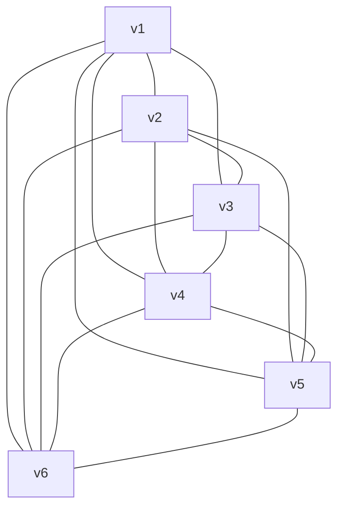
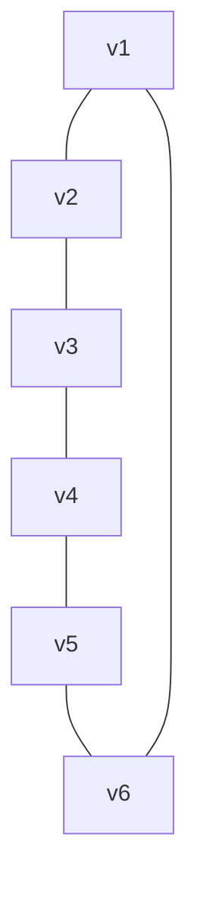
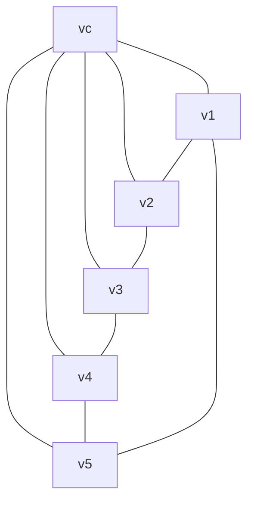
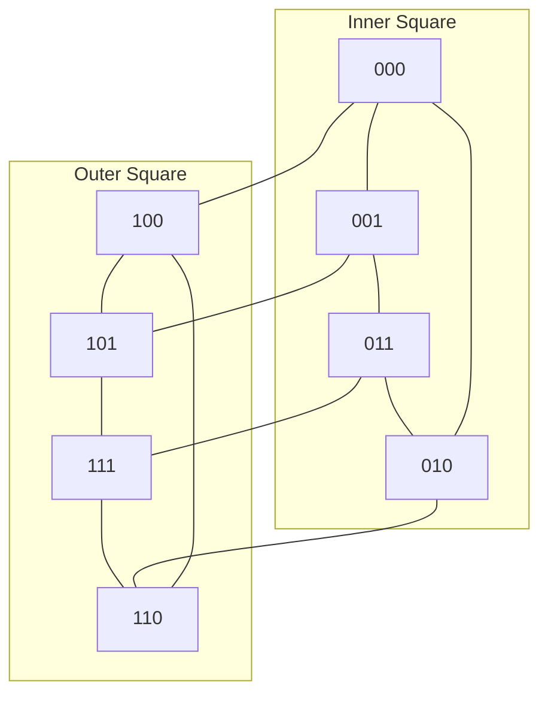
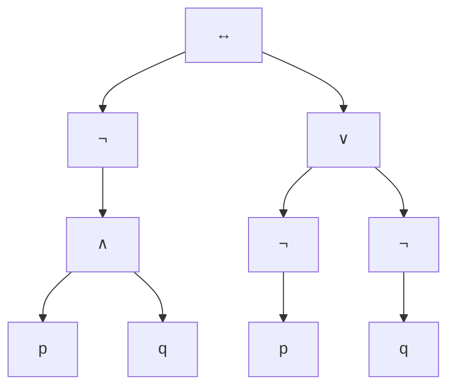
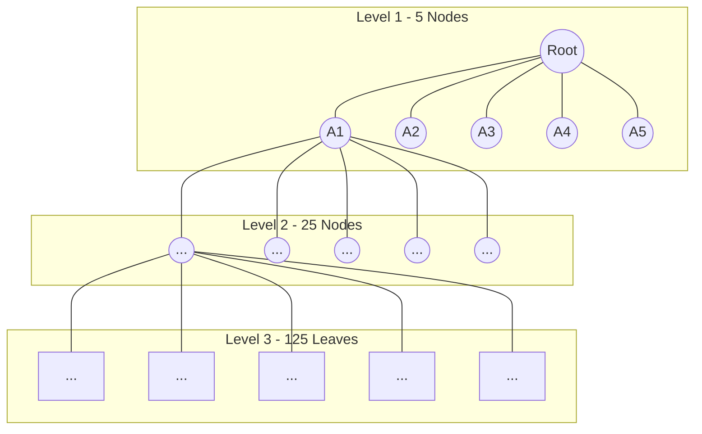
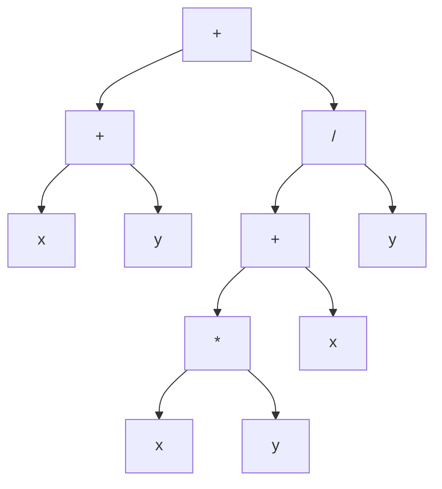

Here are the solutions formatted in English, using Mermaid diagrams for graphs, trees, and K-maps.
## **QUESTION 1**
### **a) Graphs**
#### **K_6 (Complete Graph with 6 Vertices)**

#### **C_6 (Cycle Graph with 6 Vertices)**

#### **W_6 (Wheel Graph - Central Vertex connected to C_5)**

#### **Q_3 (3-Cube Graph)**

### **b) Adjacency Matrix for K_4**
### **c) Isomorphism of Graphs G and H**
**Yes, graphs G and H are isomorphic.**
**Bijective Vertex Mapping f: V(G) \to V(H):**
 *  *  *  *  *  *  *  * Both graphs have 8 vertices, 10 edges, identical degree sequences (\text{deg}(v) \in \{2, 3\}), and adjacency structural properties are fully preserved under this mapping.
### **d) Compound Proposition Tree & Notations**
#### **Ordered Rooted Tree**

#### **Notations**
 * **Prefix:** \leftrightarrow \neg \wedge p \, q \vee \neg p \neg q
 * **Postfix:** p \, q \wedge \neg p \neg q \neg \vee \leftrightarrow
 * **Infix:** \neg(p \wedge q) \leftrightarrow (\neg p \vee \neg q)
### **e) Full m-ary Tree Properties**
#### **i) Leaves in a full 3-ary tree with 150 vertices**
 * Using l = \frac{(m - 1)n + 1}{m}:
   
   
   *(Note: A valid full 3-ary tree requires n \equiv 1 \pmod 3, i.e., n=151 \implies l = \mathbf{101})*.
#### **ii) Vertices in a full 4-ary tree with 200 internal vertices**
 * Using n = m \cdot i + 1:
   
#### **iii) Internal vertices in a full 5-ary tree with 100 leaves**
 * Using i = \frac{l - 1}{m - 1}:
   
## **QUESTION 2**
### **a) Complete 5-ary Tree of Height 3**

### **b) Expression Tree & Notations for (x+y)+((xy+x)/y)**
#### **Binary Tree**

#### **Notations**
 * **Prefix:** + + x \, y / + * x \, y \, x \, y
 * **Postfix:** x \, y + x \, y * x + y / +
### **c) Evaluate Prefix Expression: + - 1 \, 3 \, 2 \, 1 \, 2 \, 3 / 6 - 4 \, 2**
 1. Evaluate rightmost sub-expressions:
   *    *  2. Expression simplifies to: + - 1 \,\, 3 \,\, 2 \,\, 1 \,\, 2 \,\, 3 \,\, 3
 3. Evaluate left operators:
   *  4. Final sum of remaining terms:
   
### **d) Truth Table for F(x,y,z) = x\overline{y} + \overline{z}**
| x | y | z | \overline{y} | \overline{z} | x\overline{y} | F(x,y,z) |
|---|---|---|---|---|---|---|
| 0 | 0 | 0 | 1 | 1 | 0 | **1** |
| 0 | 0 | 1 | 1 | 0 | 0 | **0** |
| 0 | 1 | 0 | 0 | 1 | 0 | **1** |
| 0 | 1 | 1 | 0 | 0 | 0 | **0** |
| 1 | 0 | 0 | 1 | 1 | 1 | **1** |
| 1 | 0 | 1 | 1 | 0 | 1 | **1** |
| 1 | 1 | 0 | 0 | 1 | 0 | **1** |
| 1 | 1 | 1 | 0 | 0 | 0 | **0** |
### **e) Duals of Boolean Expressions**
 1. Dual of x(y+1):
   
 2. Dual of \overline{x}\cdot0 + (\overline{y}+z):
   
### **f) Sum-of-Products (SOP) Expansion for F(x,y,z) = (x+y)\overline{z}**
 1. Expand expression:
   
 2. Insert missing variables:
   *    *  3. Combine terms:
   
### **g) Minimal Expansion using K-Map**
#### **Minterm Mapping**
#### **K-Map Diagram**
```text
       yz
  wx   00  01  11  10
  00 [  1   0   0   1  ]  -> m0, m2
  01 [  0   1   0   0  ]  -> m5
  11 [  1   0   0   0  ]  -> m12
  10 [  1   0   1   1  ]  -> m8, m11, m10

```
#### **Grouping & Simplification**
 1. **Quad (Four corners m_0, m_2, m_8, m_{10}):** \mathbf{\overline{x}\overline{z}}
 2. **Pair (m_8, m_{12}):** \mathbf{w\overline{y}\overline{z}}
 3. **Pair (m_{10}, m_{11}):** \mathbf{w\overline{x}y}
 4. **Single cell (m_5):** \mathbf{\overline{w}x\overline{y}z}
#### **Minimal Boolean Expression**
